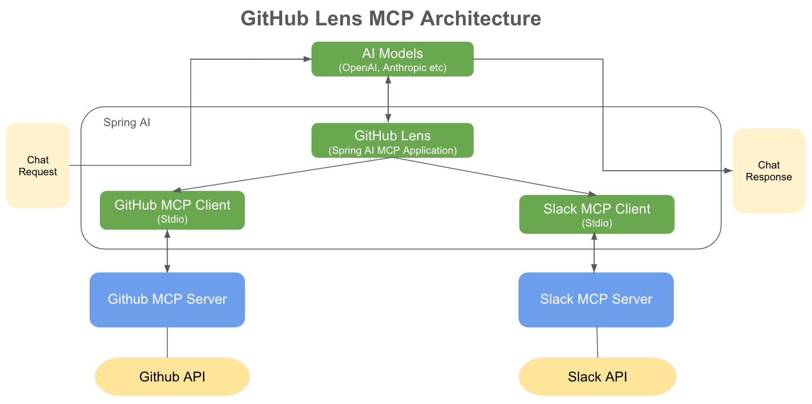

# GitHub Lens using Spring MCP(Model Context Protocol)

GitHub Lens: Your AI-powered assistant for staying on top of GitHub activities.

GitHub Lens provides real-time insights, daily summaries, and automated reminders, delivered seamlessly to your team on Slack. Built using Spring MCP (Model Context Protocol), it leverages MCP servers for [GitHub](https://github.com/modelcontextprotocol/servers/tree/main/src/github) and [Slack](https://github.com/modelcontextprotocol/servers/tree/main/src/slack) to automate routine tasks, enabling your team to stay focused on development.

## Features

- Daily summaries: Receive a concise digest of commits. open pull requests and issues 
- Automated reminders: Stay on track with notifications for overdue PRs, pending approvals, and priority issues

## How It Works

GitHub Lens is powered by Spring MCP, enabling seamless interaction between GitHub and Slack MCP servers. It uses an LLM (Large Language Model) to:

1. LLM-powered insights: Understand prompts and generate meaningful insights

2. MCP Tool Calling: Automatically invokes tools from GitHub and Slack MCP servers to fetch data or trigger actions.

3. Automated Notifications: Deliver summaries, reminders, and updates directly to Slack

## Architecture Overview

[GitHub MCP Server](https://github.com/modelcontextprotocol/servers/tree/main/src/github): Fetches repository data such as PRs, issues, and commits.

[Slack MCP Server](https://github.com/modelcontextprotocol/servers/tree/main/src/slack): Posts summaries and notifications to Slack channels.




## Prerequisites

- Java 17 or higher
- Maven 3.6+
- npx package manager
- OpenAI API Key
- Github API Key
- Slack Bot Token
- Slack Team Id

## Setup

1. Install npx (Node Package eXecute):
   First, make sure to install [npm](https://docs.npmjs.com/downloading-and-installing-node-js-and-npm)
   and then run:
   ```bash
   npm install -g npx
   ```

2. Clone the repository:
```bash
   git clone https://github.com/vudayani/spring-mcp-examples.git
   cd github-lens
```

3. Configure MCP Servers

Spring AI MCP simplifies MCP client setup by using Spring boot's auto-configuration to setup the MCP client.

Let us take a look at our configuration for Github and Slack MCP servers. Instead of manually defining MCP clients in Java, we simply configure them in an external file (`mcp-servers-config.json`) as below:

```yaml
{
  "mcpServers": {
    "github": {
      "command": "npx",
      "args": [
        "-y",
        "@modelcontextprotocol/server-github"
      ],
      "env": {
         "GITHUB_PERSONAL_ACCESS_TOKEN": "your-api-key",
      }
    },
    "slack": {
      "command": "npx",
      "args": [
        "-y",
        "@modelcontextprotocol/server-slack"
      ],
      "env": {
         "SLACK_BOT_TOKEN": "slack-bot-token",
         "SLACK_TEAM_ID": "slack-team-id"
      }
    }
  }
}
```

4. Set up your API keys:
   ```bash
   export OPENAI_API_KEY='your-openai-api-key'
   export GITHUB_PERSONAL_ACCESS_TOKEN='your-github-personal-access-token'
   export SLACK_BOT_TOKEN='your-slack-api-key'
   export SLACK_TEAM_ID='your-slack-team-id`
   ```
For detailed instructions on fetching your API tokens:
- Refer to the [GitHub MCP Server documentation](https://github.com/modelcontextprotocol/servers/tree/main/src/github)
- Refer to the [Slack MCP Server documentation](https://github.com/modelcontextprotocol/servers/tree/main/src/slack)

5. Build the application:
   ```bash
   ./mvnw clean install
   ```
   
6. Run the application using Maven:
	```bash
	./mvnw spring-boot:run
	```
