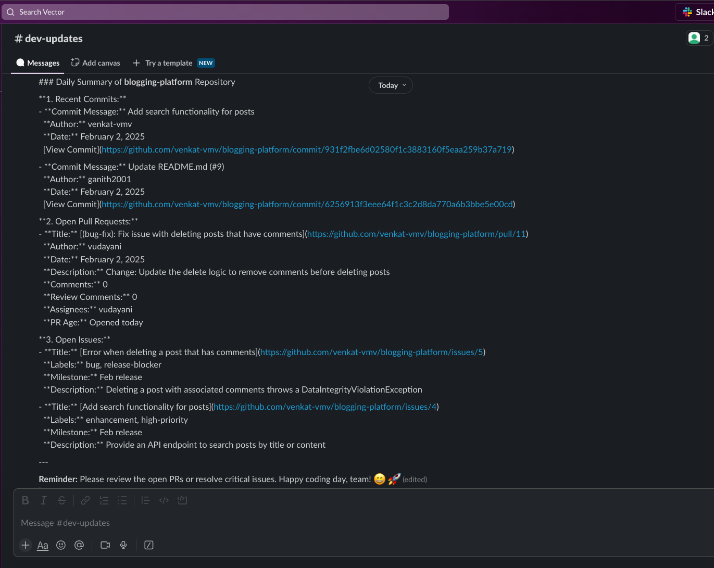

# Model Context Protocol: Unlocking the True Potential od AI workflows with Spring AI

Model Context Protocol (MCP) is an open source project initiated by Anthropic, PBC and it has been making waves in the AI community. This blog will explore MCP, a protocol designed to simplify how Large Language Models (LLMs) integrate with tools, data, and workflows to fetch the context they need. We'll discuss what MCP is, why it has garnered so much attention, and how it empowers developers to create sophisticated AI applications. We'll also take a closer look at how Spring AI adopted MCP, enabling developers to leverage this technology seamlessly. Finally, we will take a look at GitHub Lens, a demo application built using Spring AI MCP, to showcase how easy it is to build powerful AI-driven applications with MCP.

## What is Model Context Protocol?

The Model Context Protocol (MCP) is an open standard designed with the goal of addressing a major challenge in the AI Space: enabling LLMs to interact seamlessly with external tools, data sources, and systems.
By standardizing the way AI models connect to external systems, MCP simplifies the integration process, allowing LLMs to fetch the precise context they need to perform tasks effectively. This opens up exciting possibilities for developers, as they no longer need to rely on fragmented, custom integrations for every data source or system their AI models need to interact with.

At its core, MCP allows developers to:
- Tap into an ever-expanding collection of [pre-built integrations](https://github.com/modelcontextprotocol/servers) for popular tools and platforms, saving time and effort in building integrations
- Maintain flexibility to switch between different LLM vendors as their needs evolve
- Beyond just streamlining integrations, MCP also enables LLMs to access local systems and data securely. Whether it's fetching data from private databases, interacting with on-premise APIs, or processing files stored within your infrastructure, MCP ensures that LLMs can operate effectively while keeping sensitive data within a trusted boundary

## Why MCP?
In the rapidly evolving field of artificial intelligence, LLMs are only as good as the data they have access to. By default, they lack awareness of private, real-time, or constantly evolving data sources, which can severely limit their usefulness in applications requiring up-to-date and context-aware information. This is where Model Context Protocol (MCP) comes in.

### The Problem:

Traditionally, integrating LLMs with external tools and data has been a daunting challenge. Let's say you’re building an AI-powered assistant for your organization that needs to:

- Fetch product details from a private database
- Access internal tools like CRMs or support ticket systems
- Provide real-time reviews, analysis on products and send notifications

Sounds simple enough, right? But here’s where the challenge arises: Each of these systems operates independently with its own APIs, and formats. To get this data to the LLM, you’d need to write custom integrations for every system, handle calls, and update them constantly as your systems evolve. This process is not only tedious but also a huge bottleneck when scaling AI applications or workflows.

### The Solution:

MCP solves this problem by acting as a universal bridge that connects LLMs to various tools, data sources, and APIs through a standardized protocol. Here’s how it works:

**MCP Servers:** MCP servers expose data and tools (e.g., databases, APIs, private repositories) in a standardized way that the LLM can understand.
Developers can create MCP servers that follow the protocol to provide access to private or proprietary data that may not be natively accessible to the LLM, whether it’s internal HR data, financial information, or custom workflows that span across public tools like GitHub and private systems like your company’s file storage.

**MCP Clients:** MCP clients act as intermediaries, facilitating communication between the LLM and these servers

**LLM Decision-Making:** Instead of manually specifying which server or API to use, LLMs can autonomously decide which data source to query based on the task at hand. With MCP, LLMs can fetch real-time, context-aware information to generate more accurate responses. And all of this happens seamlessly and you no longer need to write custom integrations or worry about constantly updating your codebase

## MCP: Unlocking Limitless Possibilities for AI Applications
MCP is paving the way for a new era of AI-driven workflows, where LLMs can seamlessly integrate into real-world systems, accessing the information they need to solve problems in ways we never thought possible. It creates an ecosystem where LLMs don’t just rely on outdated training data—they dynamically fetch real-world, real-time information using natural language interfaces.

### Reflecting on the Past: The Challenges of Limited Context
One of the difficulties I faced a year ago when working with LLMs highlights exactly why MCP is such a game-changer. At the time, the LLMs I used were trained only up to Spring Boot 2. The problem? Spring Boot 3 had just been released (in November 2022) with significant changes—most notably, the replacement of javax with jakarta packages.

When I asked the LLM to generate a JPA example for my application, it consistently returned code based on Spring Boot 2, using outdated javax classes. The model simply didn’t have the context to generate relevant, up-to-date responses.
Sure, Retrieval-Augmented Generation (RAG) is an option for some use cases. But the challenge of dynamically providing models with private, real-time, or domain-specific data remained daunting. This is exactly where MCP shines.

### Here are some exciting ways MCP can transform the AI landscape:

1. Solving Proprietary Data Challenges
Imagine you are working with proprietary tools or applications unique to your business—tools that no LLM has ever seen. With MCP, you can create custom servers that expose the functionality of these tools in a standardized way. The LLM can then interact with these servers autonomously to:

- Fetch real-time data from private databases
- Perform actions like triggering workflows, running tasks, or generating insights
- Use natural language to help developers navigate proprietary systems or software

Many companies use proprietary software, such as custom UI frameworks, deployment strategies, or internal automation tools. For a new developer, understanding how to set up and use these tools/frameworks often requires digging through huge documentation sets, asking questions, or trial and error. This process can be overwhelming and slow down onboarding.
But if these tools are exposed as MCP servers, you could simply ask the LLM to help you onboard, and it would know what data to fetch, what APIs to call, and what steps to execute to get you started.

2. Supercharging Developer Productivity
Think about an MCP server that understands your IDE. You could say:

- Build and run my app locally
- Deploy the application to the staging environment
- Show me recent build errors and suggest fixes
The LLM, through MCP, could analyze your IDE’s configuration, interact with your app server, and perform these tasks.

3. Automating Complex Workflows
By combining multiple MCP servers, you can automate workflows that were previously fragmented or manual. For example:

- An IDE MCP server could fetch your app’s build configurations
- An App Server MCP server could deploy your app to a cluster or environment
- A GitHub MCP server could track your pull requests or fetch commit history

Now imagine the LLM orchestrating these interactions. With a single natural language command like, “Set up my app locally and deploy it to staging,” the LLM could seamlessly coordinate between these servers and execute the workflow for you.

### MCP: Widening Horizons for AI Applications

MCP isn’t just about simplifying integrations.It opens doors to building intelligent agents, complex workflows and automations on top of LLMs. By combining tools, APIs, and data sources, developers can build more powerful, context-aware AI applications, from automating tasks to enabling smarter decision-making.


## Spring AI's Adoption of MCP

It’s truly impressive to see how quickly Spring AI has embraced the Model Context Protocol (MCP). The integration of MCP into the Spring AI framework provides developers with an easy, standardized way to build AI applications that can interact with diverse data sources and services. By adopting MCP, Spring AI bridges the gap between powerful Generative AI and real-world data from different sources (whether it is local databases, private repositories, or public services like APIs), making it much simpler to create intelligent, context-aware applications.

The power lies in the ease of integration — as developers, you no longer need to manually configure multiple API calls or manage a custom solution for each data source. Spring AI MCP gives you the ability to focus on building intelligent workflows, allowing the protocol to manage the intricacies of communication between systems.

If Spring MCP already abstracts much of the complexity and the LLM orchestrates tool calls, your role shifts from building low-level logic to designing value-added capabilities and providing a seamless user experience.

## Introducing GitHub Lens: A Practical Application of MCP with Spring AI
To demonstrate the practical benefits of MCP within the Spring ecosystem, lets have a look at GitHub Lens application, an AI-powered assistant designed to keep teams informed about their GitHub repository activities. In this project we will leverage Spring AI's MCP integration and publicaly avaialble MCP servers for GitHub and Slack to automate routine tasks, enabling your team to stay focused on development. The GitHub Lens connects to GitHub to fetch data on recent commits, open pull requests, and issues. It then processes this information to generate concise summaries and reminders, which are delivered directly to the team's Slack channel.

### Key Features of GitHub Lens:
- Daily Summaries: Provides an overview of recent commits, open pull requests, and issues, helping teams stay updated with minimal effort
- Automated Reminders: Identifies pull requests pending review for more than two days and unresolved comments, sending notifications to the relevant team members to prompt action

### Architecture Overview
[GitHub MCP Server](https://github.com/modelcontextprotocol/servers/tree/main/src/github): Fetches repository data such as pull requests, issues, and commits.
[Slack MCP Server](https://github.com/modelcontextprotocol/servers/tree/main/src/slack): Posts summaries and notifications to Slack channels.

## Getting started

### 1. Prerequisites

First, make sure to install [npm](https://docs.npmjs.com/downloading-and-installing-node-js-and-npm)
and then run:
```bash
npm install -g npx
```

npx (Node Package Execute) is used later to start up the  MCP servers for GitHub and Slack locally. 

### 2. Adding Dependencies

Include the necessary dependencies and maven repository configuration in your `pom.xml`:

```xml
<!-- The spring-ai-bom ensures consistent and compatible versions for all Spring AI dependencies -->
<dependencyManagement>
	<dependencies>
		<dependency>
			<groupId>org.springframework.ai</groupId>
			<artifactId>spring-ai-bom</artifactId>
			<version>1.0.0-M5</version>
			<type>pom</type>
			<scope>import</scope>
		</dependency>
	</dependencies>
</dependencyManagement>
	
<dependencies>
	<dependency>
		<groupId>org.springframework.boot</groupId>
		<artifactId>spring-boot-starter-web</artifactId>
	</dependency>

    <!-- Spring AI integration with OpenAI for using OpenAI in the application -->
    <dependency>
		<groupId>org.springframework.ai</groupId>
		<artifactId>spring-ai-openai-spring-boot-starter</artifactId>
	</dependency>

    <!-- Spring AI MCP library for connecting with MCP servers -->	
	<dependency>
		<groupId>org.springframework.experimental</groupId>
		<artifactId>spring-ai-mcp</artifactId>
		<version>0.6.0</version>
	</dependency>
</dependencies>
```

Maven Repository Configuration

```xml
<repositories>
	<repository>
		<id>spring-milestones</id>
		<name>Spring Milestones</name>
		<url>https://repo.spring.io/libs-milestone-local</url>
		<snapshots>
			<enabled>false</enabled>
		</snapshots>
	</repository>
	<repository>
		<id>spring-snapshots</id>
		<name>Spring Snapshots</name>
		<url>https://repo.spring.io/snapshot</url>
		<releases>
			<enabled>false</enabled>
		</releases>
	</repository>
</repositories>

```

**Note**: This project uses OpenAI via Spring AI. Ensure to fetch and set the `OPENAI_API_KEY` to authenticate and interact with the LLM service.

```yaml
spring:
  ai:
    openai:
      api-key: ${OPENAI_API_KEY}
      chat:
        options:
           model: "gpt-4o"
```

### 3. Use a Forked GitHub MCP Server for Full Functionality:

The public [GitHub MCP server](https://github.com/modelcontextprotocol/servers/tree/main/src/github) provides essential functionality to interact with repositories, such as fetching and creating commits, issues. However, it does not expose all necessary tools for complete pull request management, including fetching pull requests, reviewers, merge status, and review comments.

To ensure full functionality in the GitHub Lens project, we need to use a customized version of the GitHub MCP server that exposes these missing tools. This involves:

- Clonning the forked repository which exposes the additional tools for pull request operations
- Building the MCP Server locally
- Pointing Spring MCP client to the local GitHub server

```bash
git clone https://github.com/vudayani/servers.git
cd servers/src/github
npm install
```
With this setup, the github-lens application can now fully leverage pull request operation.

### 4. MCP Client setup

To connect with the GitHub and Slack MCP servers, we need to create MCP clients. These clients act as intermediaries between your Spring AI application and the MCP servers, enabling seamless communication. Below is the setup for the GitHub and Slack MCP clients, along with an explanation of how they work.

```java
	@Bean(destroyMethod = "close")
	McpSyncClient githubMcpClient() {

		// based on https://github.com/modelcontextprotocol/servers/tree/main/src/github
		var githubMcpClient = ServerParameters.builder("npx").args("-y", "/path/to/local/servers/src/github")
				.addEnvVar("GITHUB_PERSONAL_ACCESS_TOKEN", System.getenv("GITHUB_PERSONAL_ACCESS_TOKEN")).build();

		var mcpClient = McpClient.sync(new StdioClientTransport(githubMcpClient))
				.requestTimeout(Duration.ofSeconds(10)).build();

		var init = mcpClient.initialize();

		System.out.println("MCP github client initialized: " + init);

		return mcpClient;

	}

	@Bean(destroyMethod = "close")
	McpSyncClient slackMcpClient() {

		// based on https://github.com/modelcontextprotocol/servers/tree/main/src/slack
		var slackParams = ServerParameters.builder("npx").args("-y", "@modelcontextprotocol/server-slack")
				.addEnvVar("SLACK_BOT_TOKEN", System.getenv("SLACK_BOT_TOKEN"))
				.addEnvVar("SLACK_TEAM_ID", System.getenv("SLACK_TEAM_ID")).build();

		var mcpClient = McpClient.sync(new StdioClientTransport(slackParams)).requestTimeout(Duration.ofSeconds(10))
				.build();

		var init = mcpClient.initialize();

		System.out.println("MCP slack server initialized: " + init);

		return mcpClient;

	}
```

**Note:** Update the local server path(`/path/to/local/servers/src/github`) based on your actual directory for the github server parameters

Let us break down this code:

- Server Parameters Configuration: The `ServerParameters.builder()` configures the MCP server parameters to be executed via `npx`
- Environment Variables: The required environment variables are passed to authenticate the connection:
    - For GitHub: The GITHUB_PERSONAL_ACCESS_TOKEN is fetched from the environment and used to access the GitHub API
    - For Slack: Both SLACK_BOT_TOKEN and SLACK_TEAM_ID are provided to authenticate and identify the specific Slack workspace

    For detailed instructions on fetching your API tokens:
        - Refer to the [GitHub MCP Server documentation](https://github.com/modelcontextprotocol/servers/tree/main/src/github)
        - Refer to the [Slack MCP Server documentation](https://github.com/modelcontextprotocol/servers/tree/main/src/slack)

	```bash
	export GITHUB_PERSONAL_ACCESS_TOKEN=your_github_token
	export SLACK_BOT_TOKEN=your_slack_bot_token
	export SLACK_TEAM_ID=your_slack_team_id
	```

- Creating the MCP Client: The McpClient.sync() method creates a synchronous client that communicates with the MCP server using standard I/O via the StdioClientTransport
- Initializing the Connection: The initialize() method establishes the connection to the MCP server and verifies that the server is running correctly
- Graceful Shutdown: The @Bean(destroyMethod = "close") annotation ensures that the MCP client is properly closed when the Spring application shuts down

### 5. Function Callbacks

When the application starts, the mcpClient automatically fetches a list of tools available from the MCP server. These tools represent the capabilities exposed by the server, such as fetching GitHub data or sending messages to Slack. To make these tools accessible to the AI model, we need to register them as function callbacks.

Here’s how this is implemented in the application:
```java
    @Bean
	List<McpFunctionCallback> functionCallbacks(McpSyncClient githubMcpClient, McpSyncClient slackMcpClient) {

		var githubCallbacks = githubMcpClient.listTools(null).tools().stream()
				.map(tool -> new McpFunctionCallback(githubMcpClient, tool)).toList();

		var slackCallbacks = slackMcpClient.listTools(null).tools().stream()
				.map(tool -> new McpFunctionCallback(slackMcpClient, tool)).toList();

		return Stream.concat(githubCallbacks.stream(), slackCallbacks.stream()).map(callback -> {
			try {
				return callback;
			} catch (Exception e) {
				System.err.println("Error registering tool: " + e.getMessage());
				return null;
			}
		}).filter(Objects::nonNull).toList();
	}
```

The listTools(null) method queries the MCP servers (GitHub and Slack in this case) to retrieve a list of available tools. Each tool from the server is converted into a function callback using the McpFunctionCallback class.
This transformation acts as a bridge between the tools exposed by the MCP server and the Spring AI framework, enabling the AI model to invoke these tools seamlessly during conversations.

Finally, the GitHub and Slack callbacks are combined into a single list, which is registered as a Spring Bean

### 6. Chat Client Integration

The next step is integrating them with the ChatClient. The ChatClient acts as the interface between the application and the LLMs, enabling it to leverage the tools exposed by the MCP servers. Thanks to Spring's dependency injection, this integration is seamless, requiring minimal setup.

Remember that one of the key advantages of Spring AI is its ability to seamlessly switch between different LLM providers (eg: OpenAI, Anthropic, or others) without requiring changes to the underlying application logic. In this project, I have included the OpenAI dependency and configured the OpenAI API key, letting Spring AI handle all the orchestration behind the scenes.

Let us register the function callbacks created from the MCP tools, enabling the ChatClient to access these tools during interactions
```java
    @Bean
	public ChatClient chatClient(ChatClient.Builder chatClientBuilder, List<McpFunctionCallback> functionCallbacks) {
		return chatClientBuilder.defaultFunctions(functionCallbacks.toArray(new McpFunctionCallback[0])).build();
	}
```
The LLM now has access to all registered MCP tools, allowing it to dynamically decide when and how to invoke them, removing the need for developers to manually orchestrate these interactions.

### 7. Bringing It All Together: Generating the Daily GitHub Summary

Now that we have everything set up—MCP clients, function callbacks, and the ChatClient—it’s time to build our application logic. Our goal is to summarize GitHub activity daily and send a structured update to Slack.

To achieve this, we define a cron job that triggers the LLM to summarize the GitHub activities from a repository.

```java
@Scheduled(cron = "0 0 8 * * *") // Runs every day at 8:00 AM
public void fetchAndSendGitSummary() {
    try {
        String response = chatClient
                .prompt()
                .user(u -> u.text(dailySummaryPrompt)
                        .params(Map.of("repoName", "blogging-platform", "repoOwner", "venkat-vmv")))
                .call()
                .content();
		System.out.println(response);
    } catch (Exception e) {
        System.err.println("Error fetching daily GitHub summary: " + e.getMessage());
        e.printStackTrace();
    }
}
```

Define the 	`dailySummaryPrompt`  with instructions the LLM to generate the Github summary.

```bash
Provide a daily summary of the GitHub repository {repoName} owned by {repoOwner}. The summary should include the following sections:

### **1. Recent Commits:**
   - Summarize latest commits made to the 'main' branch in the last 24 hours
   - For each commit, include:
     - Commit messages (with a Short description if available of the commit purpose)
     - Authors and date
     - Direct link to the commit  

### **2. Open Pull Requests:**
   - List all open pull requests, highlighting:
	  - Title with a direct link to the PR
	  - Author and date
	  - Short description** of the PR's purpose
	  - Number of comments and review comments within the PR
	  - Requested reviewers (if any)
	  - PR age (e.g., "Opened 5 days ago")
	  
   - Highlight PRs that need attention (if applicable):
      - PRs that have been open for more than 2 days
      - PRs with pending reviewer actions or unresolved comments
	  - Tag the reviewers/assignees to bring this to their attention

### **3. Open Issues:**
   - List high-priority open issues, prioritizing those labeled "release-blocker" or "high-priority"
   - Filter issues by type `is:issue`, `is:open`, `label:high-priority`, `label:release-block`
   - For each issue, include:
   	  - Title with a direct link to issue
	  - Labels or milestones
  	  - Brief description of the issue (if available) 

### **4. Formatting for Slack:**
   - Present the information in a structured and well-organized format
   - Use **bold headings** (`*Recent Commits*`)
   - Use **bullet points** for clarity
   - **Include direct links** for quick access
   - If a section has no updates, clearly indicate with:  
      *No new commits in the last 24 hours.*  
   - End with a gentle reminder for the team to review PRs or resolve critical issues and wishing a happy coding day
   - Structure the summary with sections, bullet points, bold headings or attachments for clear readability
   - Post the summary to the **'#dev-updates'** Slack channel
   
The summary should be concise, clear, and actionable to help the development team quickly understand the repository's status and priorities
```

### The Magic Behind the Scenes
Once the cron job runs, Spring AI and MCP take over the execution flow:

#### The LLM Receives the Prompt and Decides Which Tools to Call
- The LLM receives the prompt along with the avaialble tools embedded into the system prompt
- Unlike traditional approaches where we manually orchestrate API calls, Spring AI lets the LLM decide what it needs to execute
- The LLM analyzes the prompt and determines the necessary tools to fetch the required data:
	- Latest commits -> calls the `list_commits` tool
	- Open pull requests -> calls the `list_pull_requests` tool
	- Open issues -> calls the `list_issues` tool

	- Slack channels -> calls the `slack_list_channels` tool to fetch the channel ID
	- Post the summary to Slack -> calls `slack_post_message` to send the final message

- The LLM instructs the application on how to execute these tools

#### MCP Clients Execute Tool Calls
The Spring AI MCP Client handles all communication with the GitHub MCP Server and Slack MCP Server. The necessary tools are executed automatically and the fetched data is returned to the LLM.
The LLM then structures the results according to the original prompt’s instructions, preparing the summary in the desired format.
Finally, the LLM directs the application to post the summary to the #dev-updates Slack channel via the Slack MCP Server.

Below is the end result— Slack message posted to the channel:




##### Why This is Powerful
With just a few lines of code, we have built an AI-powered GitHub assistant that:
- Requires no manual API orchestration
- Automatically determines the data needed based on natural language instructions
- Handles real-time execution and dynamic tool selection
- Posts a fully formatted summary to Slack

This approach highlights the power of MCP and Spring AI, allowing us to build intelligent workflows.

### Conclusion

