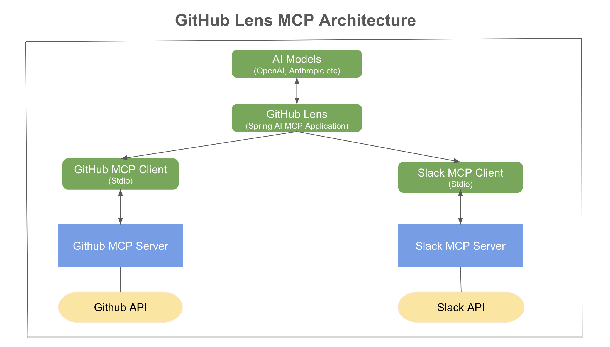
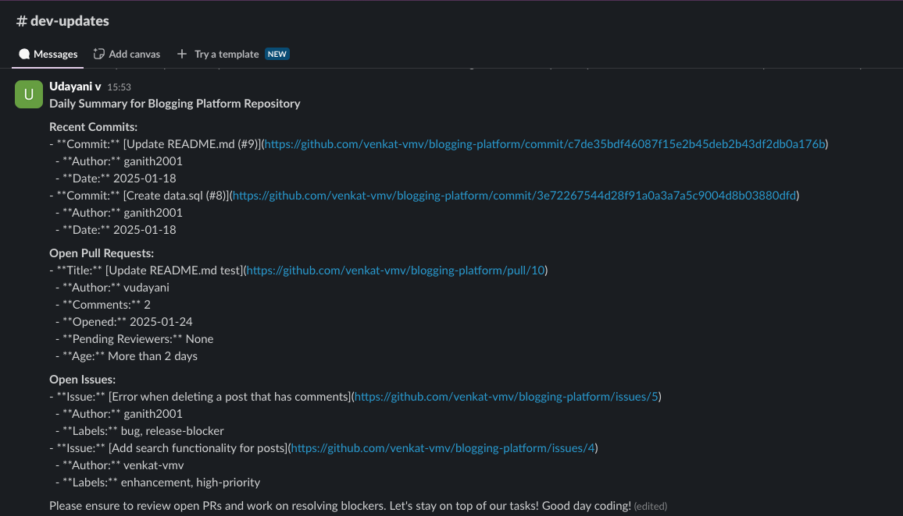
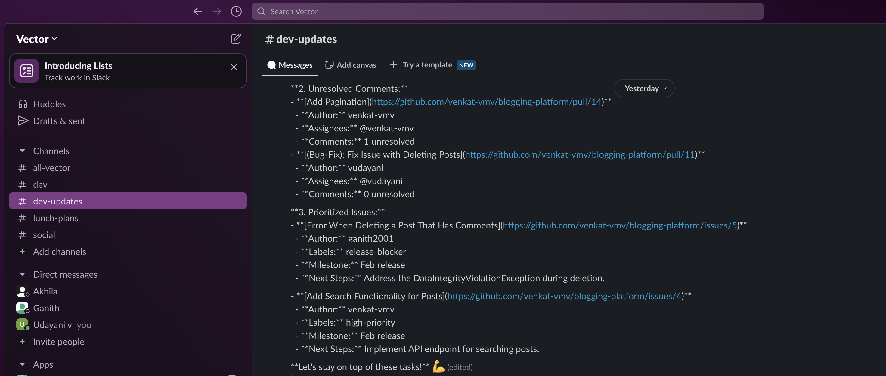

# Model Context Protocol: Unlocking AI’s Full Potential with Spring AI

The Model Context Protocol (MCP) is a game-changer in AI integration, enabling Large Language Models (LLMs) to seamlessly connect with tools, data sources, and workflows. Developed by Anthropic, MCP provides a standardized and composable way for AI applications to fetch real-time, context-aware information, eliminating the need for custom integrations.

In this blog, we’ll explore:

- What MCP is and why it's gaining so much traction
- How Spring AI has adopted MCP to simplify AI-driven development
- A practical GitHub Lens example demonstrating MCP’s capabilities in action using Spring AI MCP

## What is Model Context Protocol?

The Model Context Protocol (MCP) is an open standard designed with the goal of addressing a fundamental challenge in AI Space: enabling LLMs to interact seamlessly with external tools, data sources, and systems without requiring custom-built integrations. 
Instead of manually wiring integrations and data retrieval logic, developers can use MCP to create plug-and-play AI systems that adapt to changing needs effortlessly.

## Why MCP?

In the rapidly evolving field of artificial intelligence, LLMs are only as good as the data they have access to. Traditionally, integrating LLMs with external tools and data has been a daunting challenge. Let's say you’re building an AI-powered assistant for your organization that needs to:

- Fetch product details from database
- Access internal tools like CRMs or support ticket systems
- Provide real-time reviews, analysis on products and send notifications

Sounds simple enough, right? But here’s where the challenge arises: Each system has its own APIs and formats, making integration complex and time-consuming. To get this data to the LLM, you’d need to write custom integrations and update them constantly as your systems evolve. 

MCP eliminates these bottlenecks by providing a universal interface between LLMs and external systems.

## How MCP Works?

Here’s how it works:

**MCP Servers:** MCP Servers expose data, tools, and prompts in a standardized way that LLMs can understand.  With tools, LLMs can not only retrieve information from databases, APIs, or repositories but also trigger actions—such as creating a support ticket, sending a notification, or executing a workflow

**MCP Clients:** Intermediaries that connect LLMs to MCP servers, facilitating seamless communication

**LLM Decision-Making:** LLMs dynamically determine which tools or data sources to use based on the task at hand. This eliminates the need for hardcoded integrations, making AI-driven workflows more adaptable and scalable.

With MCP, AI applications gain real-time, context-aware intelligence without the complexity of custom integrations.

## Spring AI's Adoption of MCP

Spring AI has swiftly adopted the Model Context Protocol (MCP), making it easier for developers to integrate LLMs with diverse data sources and services. 
Instead of manually managing multiple API calls or writing custom integrations, Spring AI MCP abstracts away this complexity, allowing LLMs to interact seamlessly with external tools—without requiring low-level logic.

This bridges the gap between Generative AI and real-time data, making it much simpler to create intelligent, context-aware applications.
With Spring AI MCP, developers can focus on business logic while the framework efficiently manages system interactions.

## Introducing GitHub Lens: A Practical Application of MCP with Spring AI

To see MCP in action within the Spring ecosystem, let’s explore GitHub Lens application, an AI-powered assistant designed to keep teams informed about their GitHub repository activities.
This project leverages Spring AI's MCP integration and publicly available MCP servers for GitHub and Slack to automate routine tasks—keeping your team focused on development.

### How It Works
GitHub Lens connects to GitHub to track recent commits, open pull requests, and issues. It then processes this information into concise summaries and reminders, which are delivered directly to the team's Slack channel.

### Key Features of GitHub Lens:
- **Daily Summaries:** Get an overview of recent commits, open pull requests, and issues to stay updated with minimal effort 
- **Automated Reminders:** Identify pull requests pending review for more than two days and unresolved comments, sending notifications to relevant team members to prompt action

### Architecture Overview

To better understand how MCP integrates into GitHub Lens, here’s an architecture diagram illustrating how different MCP components interact:



- The LLM interacts with MCP clients to fetch and process data dynamically
- The GitHub and Slack MCP clients communicate with their respective MCP Servers:
	- **[GitHub MCP Server](https://github.com/modelcontextprotocol/servers/tree/main/src/github)**: Fetches repository data (pull requests, issues, commits)
	- **[Slack MCP Server](https://github.com/modelcontextprotocol/servers/tree/main/src/slack)**: Posts summaries and notifications to Slack channels

## Getting started

### 1. Prerequisites

Ensure you have [npm](https://docs.npmjs.com/downloading-and-installing-node-js-and-npm) installed, then run the following command: 
```bash
npm install -g npx
```

npx (Node Package Execute) is used later to start up the  MCP servers for GitHub and Slack locally. 

### 2. Adding Dependencies

Include the necessary dependencies and maven repository configuration in your `pom.xml`:

```xml
<!-- The spring-ai-bom ensures consistent and compatible versions for all Spring AI dependencies -->
<dependencyManagement>
	<dependencies>
		<dependency>
			<groupId>org.springframework.ai</groupId>
			<artifactId>spring-ai-bom</artifactId>
			<version>1.0.0-SNAPSHOT</version>
			<type>pom</type>
			<scope>import</scope>
		</dependency>
	</dependencies>
</dependencyManagement>
	
<dependencies>
	<dependency>
		<groupId>org.springframework.boot</groupId>
		<artifactId>spring-boot-starter-web</artifactId>
	</dependency>

	<!-- Spring AI integration with OpenAI for using OpenAI in the application -->
	<dependency>
		<groupId>org.springframework.ai</groupId>
		<artifactId>spring-ai-openai-spring-boot-starter</artifactId>
	</dependency>

	<!-- Spring AI MCP client library for integrating with MCP servers -->	
	<dependency>
		<groupId>org.springframework.ai</groupId>
		<artifactId>spring-ai-mcp-client-spring-boot-starter</artifactId>
	</dependency>
</dependencies>
```

Maven Repository Configuration

```xml
<repositories>
	<repository>
		<id>spring-milestones</id>
		<name>Spring Milestones</name>
		<url>https://repo.spring.io/libs-milestone-local</url>
		<snapshots>
			<enabled>false</enabled>
		</snapshots>
	</repository>
	<repository>
		<id>spring-snapshots</id>
		<name>Spring Snapshots</name>
		<url>https://repo.spring.io/snapshot</url>
		<releases>
			<enabled>false</enabled>
		</releases>
	</repository>
</repositories>

```

### 3. Set Up OpenAI API Key

This project uses OpenAI via Spring AI. Ensure to fetch and set the `OPENAI_API_KEY` to authenticate and interact with the LLM service.

```yaml
spring:
  ai:
    openai:
      api-key: ${OPENAI_API_KEY}
      chat:
        options:
           model: "gpt-4o"
```

### 4. Use a Forked GitHub MCP Server for Full Functionality:

The public [GitHub MCP server](https://github.com/modelcontextprotocol/servers/tree/main/src/github) provides essential functionality to interact with repositories, such as fetching and creating commits, issues. 
However, as of today, it does not expose all necessary tools for complete pull request management, including fetching pull requests, reviewers, merge status, and review comments.

To ensure full functionality in the GitHub Lens project, we will use a forked version of the GitHub MCP server with extended functionality. This involves:

1. Clonning the forked repository which exposes the additional tools for pull request operations
```bash
git clone https://github.com/vudayani/servers.git
cd servers/src/github
```
2. Building the MCP Server locally
```bash
npm install
```
3. Note the directory path, as it will be needed in the next step to configure the Spring MCP client to point to the local GitHub MCP server

```bash
pwd
```

With this setup, the GitHub Lens application can now fully leverage pull request operations.

### 5. MCP Client setup

Spring AI’s MCP integration has undergone a major transformation in 1.0.0 M6, introducing a simpler, more powerful approach to AI-driven workflows.

Setting up an MCP client no longer requires boilerplate code, manual bean definitions, or function registration. Everything is abstracted away into simple configuration properties, making it effortless to integrate with MCP servers.

Let us take a look at our configuration for Github and Slack MCP servers. Instead of manually defining MCP clients in Java, we simply configure them in an external file (`mcp-servers-config.json`) as below:

```yaml
{
  "mcpServers": {
    "github": {
      "command": "npx",
      "args": [
        "-y",
        "/path/to/local/servers/src/github"
      ],
      "env": {
		"GITHUB_PERSONAL_ACCESS_TOKEN": "your-api-key",
      }
    },
	"slack": {
	  "command": "npx",
	  "args": [
		"-y",
		"@modelcontextprotocol/server-slack"
	  ],
	  "env": {
		"SLACK_BOT_TOKEN": "slack-bot-token",
		"SLACK_TEAM_ID": "slack-team-id"
	  }
	}
  }
}
```

**Note:** Update the local server path(`/path/to/local/servers/src/github`) based on your actual directory fetched in the previous step in the github server arguments.

**Environment Variables:** The required environment variables are passed to authenticate the connection.
You can choose one of the following methods to set the environment variables:

Option 1: Define environment variables in mcp-servers-config.json
- This is useful when you want all configurations in one place
- Tokens are stored in the JSON file (be mindful of security best practices!)

Option 2: Export environment variables instead of storing in JSON
- This keeps sensitive credentials out of config files
- Set them globally using terminal commands:
```bash
	export GITHUB_PERSONAL_ACCESS_TOKEN=your_github_token
	export SLACK_BOT_TOKEN=your_slack_bot_token
	export SLACK_TEAM_ID=your_slack_team_id
```

For detailed instructions on fetching your API tokens:
- Refer to the [GitHub MCP Server documentation](https://github.com/modelcontextprotocol/servers/tree/main/src/github)
- Refer to the [Slack MCP Server documentation](https://github.com/modelcontextprotocol/servers/tree/main/src/slack)


#### Link the JSON Configuration in application.yml 
To make Spring AI load this configuration, add the following to `application.yml`

```yaml
spring:
  ai:
    mcp:
      client:
        stdio:
          servers-configuration: classpath:mcp-servers-config.json
```

That is it, your client setup to communicate to Gihub and Slack is ready. 

#### What’s Happening Under the Hood?
Spring AI automatically:
- Creates MCP clients for each configured server (GitHub & Slack in this case)
- Manages transport layer (stdio) and executes the MCP commands
- Passes required environment variables (example: GitHub & Slack API tokens)
- Fully Automated Function Callbacks - Auto-discovers tools exposed by MCP servers and registers them as function callbacks, so the AI model can directly invoke MCP tools without extra setup

With all the heavy lifting handled by Spring AI MCP, we can directly jump into building our AI-powered application.

#### Choosing the Right MCP Client Type & Transport Option
Spring AI MCP provides flexibility in how clients communicate with servers. Based on your application’s requirements, you can choose the appropriate client type and transport mechanism.

**Multiple Transport Options in MCP**

MCP clients can communicate with servers using different transport mechanisms:

- STDIO (Default, Used in Our Example): Process-based communication between the application and the MCP server
- SSE (Server-Sent Events):  Ideal for event-driven applications requiring streaming responses
- Java HttpClient-based SSE transport: Suitable for high-performance streaming over HTTP
- Spring-Specific Transports:
	- WebFlux SSE -> Reactive HTTP streaming
	- WebMVC SSE -> Servlet-based HTTP streaming

Notice, we are using STDIO (`spring.ai.mcp.client.stdio`) in Github Lens as it is simple and works well for process-based interactions with local MCP servers.

**MCP Client Types: Synchronous vs. Asynchronous**

Spring AI MCP supports two types of clients, depending on whether your application needs blocking or non-blocking execution:

1. Synchronous Client (Default, Used in Our Example)
- Uses blocking operations
- Best suited for request-response workflows, where each request waits for a result before proceeding

2. Asynchronous Client
- Uses non-blocking operations.
- Ideal for reactive applications that handle high concurrency and streaming responses.

For our GitHub Lens project, we use the `SYNC` client since it follows a structured request-response pattern.

**How to switch between clients?**

Update `application.yml` to select either SYNC (default) or ASYNC:

```yaml
spring:
  ai:
    mcp:
      client:
        type: ASYNC  # Change to SYNC for blocking operations
```

Next, we’ll explore how GitHub Lens uses these tools to interact with GitHub and Slack.

### 6. Chat Client Integration

With our MCP clients setup, the next step is integrating them with Spring AI’s ChatClient. The ChatClient acts as the interface between the application and the LLMs, enabling it to leverage the tools exposed by the MCP servers. Thanks to Spring's dependency injection, this integration is seamless, requiring minimal setup.

One of the key benefits of Spring AI is its ability to easily switch between LLM providers (eg: OpenAI, Anthropic, or others) without modifying application logic. In this project, we have included the OpenAI dependency and configured the OpenAI API key, letting Spring AI handle all the orchestration behind the scenes.

Spring AI automatically discovers and registers MCP tools as tool callbacks, making them available for AI interactions. We simply pass these tools into the ChatClient using Spring's dependency injection:
```java
	@Bean
	public ChatClient chatClient(ChatClient.Builder chatClientBuilder, ToolCallbackProvider tools) {
		return chatClientBuilder
				.defaultTools(tools)
				.build();
	}
```
The LLM now has access to all registered MCP tools, allowing it to dynamically decide when and how to invoke them, removing the need for developers to manually orchestrate these interactions.

**Note**: While tool calling seems like a LLM model responsibility, it is actually the client application that executes tool calls.
The LLM decides and requests a tool call and provides the necessary input arguments, but the application executes the tool call using the provided inputs, and returns the results.

This separation ensures secure execution, as the AI model never directly interacts with external APIs. It can only request actions, while the application maintains full control over execution and security.

### 7. Bringing It All Together: Generating the Daily GitHub Summary

Now that we have everything set up—MCP clients, server configurations, tool callbacks, and the chatClient—it’s time to build our application logic.
Our goal is to summarize GitHub activity daily and send a structured update to Slack.

To achieve this, we define a cron job that triggers the LLM to summarize the GitHub activities from a repository.

```java
@Scheduled(cron = "0 0 8 * * *") // Runs every day at 8:00 AM
public void fetchAndSendGitSummary() {
    try {
        String response = chatClient
                .prompt()
                .user(u -> u.text(dailySummaryPrompt)
                        .params(Map.of("repoName", "blogging-platform", "repoOwner", "venkat-vmv")))
                .call()
                .content();
		System.out.println(response);
    } catch (Exception e) {
        System.err.println("Error fetching daily GitHub summary: " + e.getMessage());
        e.printStackTrace();
    }
}
```

#### Defining the dailySummaryPrompt
The `dailySummaryPrompt` instructs the LLM to gather and format a GitHub activity summary:

```bash
Provide a daily summary of the GitHub repository {repoName} owned by {repoOwner}. The summary should include the following sections:

### **1. Recent Commits:**
   - Summarize latest commits made to the 'main' branch in the last 24 hours
   - For each commit, include:
     - Commit messages (with a Short description if available of the commit purpose)
     - Authors and date
     - Direct link to the commit  

### **2. Open Pull Requests:**
   - List all open pull requests, highlighting:
	  - Title with a direct link to the PR
	  - Author and date
	  - Short description** of the PR's purpose
	  - Number of comments and review comments within the PR
	  - Requested reviewers (if any)
	  - PR age (e.g., "Opened 5 days ago")
	  
   - Highlight PRs that need attention (if applicable):
      - PRs that have been open for more than 2 days
      - PRs with pending reviewer actions or unresolved comments
	  - Tag the reviewers/assignees to bring this to their attention

### **3. Open Issues:**
   - List high-priority open issues, prioritizing those labeled "release-blocker" or "high-priority"
   - Filter issues by type `is:issue`, `is:open`, `label:high-priority`, `label:release-block`
   - For each issue, include:
   	  - Title with a direct link to issue
	  - Labels or milestones
  	  - Brief description of the issue (if available) 

### **4. Formatting for Slack:**
   - Present the information in a structured and well-organized format
   - Use **bold headings** (`*Recent Commits*`)
   - Use **bullet points** for clarity
   - **Include direct links** for quick access
   - If a section has no updates, clearly indicate with:  
      *No new commits in the last 24 hours.*  
   - End with a gentle reminder for the team to review PRs or resolve critical issues and wishing a happy coding day
   - Structure the summary with sections, bullet points, bold headings or attachments for clear readability
   - Post the summary to the **'#dev-updates'** Slack channel
   
The summary should be concise, clear, and actionable to help the development team quickly understand the repository's status and priorities
```

### The Magic Behind the Scenes
Once the cron job runs, Spring AI and MCP take over the execution flow:

#### The LLM Receives the Prompt and Determines Tool Calls
Unlike traditional approaches where we manually orchestrate API calls, Spring AI lets the LLM decide what actions to take dynamically:

- The LLM receives the prompt along with the available tools embedded into the system prompt
- The LLM analyzes the prompt and determines which tools to invoke to fetch the required data:
	- Latest commits -> calls the `list_commits` tool
	- Open pull requests -> calls the `list_pull_requests` tool
	- Open issues -> calls the `list_issues` tool

	- Slack channels -> calls the `slack_list_channels` tool to fetch the channel ID
	- Post the summary to Slack -> calls `slack_post_message` to send the final message

- The LLM passes the necessary inputs and requests the application to execute these tools

#### MCP Clients Execute Tool Calls
The Spring AI MCP Client handles all communication with the GitHub MCP Server and Slack MCP Server. The necessary tools are executed automatically and the fetched data is returned to the LLM.
The LLM then structures the results according to the original prompt’s instructions, preparing the summary in the desired format.
Finally, the LLM directs the application to post the summary to the #dev-updates Slack channel via the Slack MCP Server.

Below is the end result— Slack message posted to the channel:



#### Extending This Further: Automated PR & Issue Reminders
While we explored fetching Daily GitHub Summaries, this approach can be easily extended to cover automated reminders for:
- Unresolved PR comments requiring attention
- Pull requests pending review for more than two days
- High-priority issues for the milestone (e.g., high-priority label)

The execution flow remains the same, with only the prompt fine-tuned to focus on specific cases.

Below is an example of Slack notifications for automated reminders:



This allows you to customize and scale GitHub Lens to your team’s specific needs!

#### Why This is Powerful
With just a few lines of code, we have built an AI-powered GitHub assistant that:
- Requires no manual API orchestration - The LLM decides what tools to invoke
- Zero boilerplate logic - Spring AI MCP automates tool execution
- Easily extensible – Add new tools by updating configurations, not code
- Automatically determines the data needed based on natural language instructions
- Handles real-time execution and dynamic tool selection

This approach highlights the power of MCP and Spring AI, enabling developers to effortlessly build intelligent, automated workflows that adapt to changing requirements without additional code.

## MCP: Unlocking Limitless Possibilities for AI Applications
The GitHub Lens is just one example of MCP in action. Beyond developer workflows, MCP creates an ecosystem where LLMs can seamlessly integrate with real-world systems, automate workflows, and access real-time information dynamically.

### Here are some exciting ways MCP can transform the AI landscape:

1. **Solving Proprietary Data Challenges**

	Imagine you are working with proprietary tools or applications unique to your business—tools that no LLM has ever seen. With MCP, you can create custom servers that expose the functionality of these tools in a standardized way. The LLM can then interact with these servers autonomously to:

- Fetch real-time data from databases
- Perform actions like triggering workflows, running tasks, or generating insights
- Use natural language to help developers navigate proprietary systems or software

	Many companies use proprietary software, such as custom UI frameworks, deployment strategies, or internal automation tools. For a new developer, understanding how to set up and use these tools/frameworks often requires digging through huge documentation sets, asking questions, or trial and error. This process can be overwhelming and slow down onboarding.
	But if these tools are exposed as MCP servers, you could simply ask the LLM to help you onboard, and it would know what data to fetch, what APIs to call, and what steps to execute to get you started.

2. **Supercharging Developer Productivity**

	Think about an MCP server that understands your IDE. You could say:

- Build and run my app locally
- Deploy the application to the staging environment
- Show me recent build errors and suggest fixes

	The LLM, through MCP, could analyze your IDE’s configuration, interact with your app server, and perform these tasks.

3. **Automating Complex Workflows**

	By combining multiple MCP servers, you can automate workflows that were previously fragmented or manual. For example:

- An IDE MCP server could fetch your app’s build configurations
- An App Server MCP server could deploy your app to a cluster or environment
- A GitHub MCP server could track your pull requests or fetch commit history

	Now imagine the LLM orchestrating these interactions. With a single natural language command like, “Set up my app locally and deploy it to staging,” the LLM could seamlessly coordinate between these servers and execute the workflow for you.

## Conclusion

We've explored how MCP and Spring AI MCP unlock new possibilities for AI-driven workflows, seamlessly integrating LLMs with external systems. The GitHub Lens example demonstrated how MCP simplifies complex interactions, making AI-powered automation effortless.

But this is just the beginning!

To explore this project in more detail, visit the [GitHub repository](https://github.com/vudayani/spring-mcp-examples/tree/main/github-lens)

If you're excited to explore another real-world use case? Take a look at [Lunch Planner](https://github.com/vudayani/spring-mcp-examples/tree/main/lunch-planner), an MCP-powered AI assistant that helps coordinate lunch plans based on team preferences

MCP is transforming AI-driven workflows, enabling smarter automation and seamless integrations. Give it a try and start building AI-powered applications!