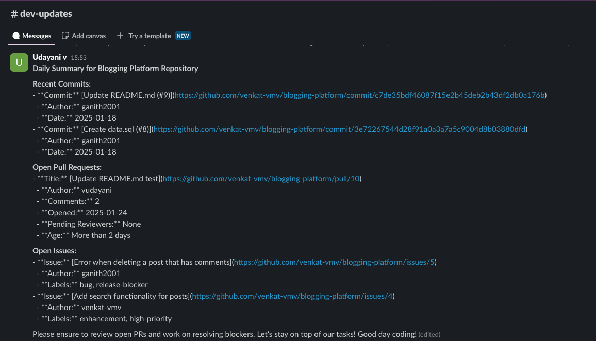
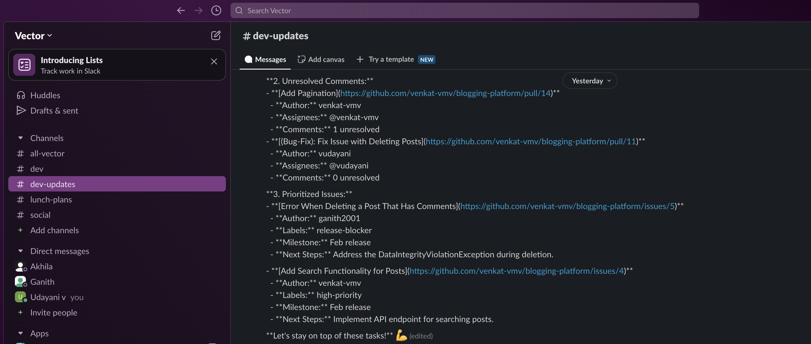

# Model Context Protocol: Unlocking AI’s Full Potential with Spring AI

The Model Context Protocol (MCP) is a game-changer in AI integration, enabling Large Language Models (LLMs) to seamlessly connect with tools, data sources, and workflows. Developed by Anthropic, MCP provides a standardized and composable way for AI applications to fetch real-time, context-aware information, eliminating the need for custom integrations.

In this blog, we’ll explore:

- What MCP is and why it's gaining so much traction
- How Spring AI has adopted MCP to simplify AI-driven development
- A practical GitHub Lens example demonstrating MCP’s capabilities in action using Spring AI MCP

## What is Model Context Protocol?

The Model Context Protocol (MCP) is an open standard designed with the goal of addressing a fundamental challenge in AI Space: enabling LLMs to interact seamlessly with external tools, data sources, and systems without requiring custom-built integrations. 
Instead of manually wiring integrations and data retrieval logic, developers can use MCP to create plug-and-play AI systems that adapt to changing needs effortlessly.

## Why MCP?

In the rapidly evolving field of artificial intelligence, LLMs are only as good as the data they have access to. Traditionally, integrating LLMs with external tools and data has been a daunting challenge. Let's say you’re building an AI-powered assistant for your organization that needs to:

- Fetch product details from database
- Access internal tools like CRMs or support ticket systems
- Provide real-time reviews, analysis on products and send notifications

Sounds simple enough, right? But here’s where the challenge arises: Each system has its own APIs and formats, making integration complex and time-consuming. To get this data to the LLM, you’d need to write custom integrations and update them constantly as your systems evolve. 

MCP eliminates these bottlenecks by providing a universal interface between LLMs and external systems.

## How MCP Works?

Here’s how it works:

**MCP Servers:** MCP Servers expose data, tools, and prompts in a standardized way that LLMs can understand.  With tools, LLMs can not only retrieve information from databases, APIs, or repositories but also trigger actions—such as creating a support ticket, sending a notification, or executing a workflow

**MCP Clients:** Intermediaries that connect LLMs to MCP servers, facilitating seamless communication

**LLM Decision-Making:** LLMs dynamically determine which tools or data sources to use based on the task at hand. This eliminates the need for hardcoded integrations, making AI-driven workflows more adaptable and scalable.

With MCP, AI applications gain real-time, context-aware intelligence without the complexity of custom integrations.

## Spring AI's Adoption of MCP

Spring AI has swiftly adopted the Model Context Protocol (MCP), making it easier for developers to integrate LLMs with diverse data sources and services. 
Instead of manually managing multiple API calls or writing custom integrations, Spring AI MCP abstracts away this complexity, allowing LLMs to interact seamlessly with external tools—without requiring low-level logic.

This bridges the gap between Generative AI and real-time data, making it much simpler to create intelligent, context-aware applications.
With Spring AI MCP, developers can focus on business logic while the framework efficiently manages system interactions.

To understand this better, let's start with the basics — building a simple Spring AI client. This will provide a foundation before we progressively integrate MCP tools to simplify external data fetching and automation.

## Setting Up a Basic Spring AI Client

First, let's create a minimal Spring AI client that interacts with an LLM. This will help us understand how Spring AI works before we integrate MCP tools.

### 1. Adding Dependencies

Include the necessary dependencies and maven repository configuration in your `pom.xml`:

```xml
<!-- The spring-ai-bom ensures consistent and compatible versions for all Spring AI dependencies -->
<dependencyManagement>
	<dependencies>
		<dependency>
			<groupId>org.springframework.ai</groupId>
			<artifactId>spring-ai-bom</artifactId>
			<version>1.0.0-SNAPSHOT</version>
			<type>pom</type>
			<scope>import</scope>
		</dependency>
	</dependencies>
</dependencyManagement>
<!-- Spring AI integration with OpenAI for using OpenAI in the application -->
<dependency>
	<groupId>org.springframework.ai</groupId>
	<artifactId>spring-ai-openai-spring-boot-starter</artifactId>
</dependency>
```

Maven Repository Configuration

```xml
<repositories>
	<repository>
		<id>spring-milestones</id>
		<name>Spring Milestones</name>
		<url>https://repo.spring.io/libs-milestone-local</url>
		<snapshots>
			<enabled>false</enabled>
		</snapshots>
	</repository>
	<repository>
		<id>spring-snapshots</id>
		<name>Spring Snapshots</name>
		<url>https://repo.spring.io/snapshot</url>
		<releases>
			<enabled>false</enabled>
		</releases>
	</repository>
</repositories>
```

### 2.Configuring OpenAI

This project uses OpenAI via Spring AI. Ensure to fetch and set the `OPENAI_API_KEY` to authenticate and interact with the LLM service. Set the environment variable and update `application.yml`:

```yaml
spring:
  ai:
    openai:
      api-key: ${OPENAI_API_KEY}
      chat:
        options:
           model: "gpt-4o"
```

### 3. Creating a Simple Chat Client

Now, let's create a basic ChatClient and submit a prompt:

```java
@Bean
public ChatClient chatClient(ChatClient.Builder chatClientBuilder) {
    return chatClientBuilder.build();
}

public void simplePrompt() {
    String response = chatClient
            .prompt()
            .user(u -> u.text("Tell me a joke"))
            .call()
            .content();
    System.out.println(response);
}
```
Run the application and see the response.

## Fetching GitHub Activity Summary 

Now that we've built a basic chat client, let's take this a step further and generate a GitHub summary for a repository and send a Slack notfication of the summary. Suppose you want to track recent commits, open pull requests, and issues, then get a concise summary with action items posted to Slack channel.

#### How would we achieve this?

We would either manually fetch data from GitHub by authenticating and calling GitHub & Slack APIs or call an available API server that does this for us. Regardless, we still need to:

- Authenticate requests and handle API calls to Github and Slack
- Extract, structure, and feed the relevant data into prompts manually
- Maintain custom API logic whenever requirements change

```java
public void generateGitHubSummary() {

	// Step 1: Fetch GitHub Data
    String commits = fetchCommits();
    String pullRequests = fetchPullRequests();
    String issues = fetchIssues();

	// Step 2: Generate Summary using LLM
    String response = chatClient
            .prompt()
            .user(u -> u.text("Summarize the following GitHub data:\nCommits: " + commits + "\nPRs: " + pullRequests + "\nIssues: " + issues))
            .call()
            .content();
    System.out.println(response);

	// Step 3: Post Summary to Slack
	String slackChannelId = fetchSlackChannelId("#dev-updates"); // Find channel ID dynamically
    if (slackChannelId != null) {
    	postSummaryToSlack(response, slackChannelId);
    }
}

private String fetchCommits() {
  // Authenticate to GitHub server with GitHub token
  // Use GitHub APIs to fetch commits for a repo and return
  // or Call a publically available Github server to fetch relavant data
}

private boolean postSummaryToSlack(String response, String channelId) {
	// Call Slack APIs to post the message to channel
}

private String fetchSlackChannelId(String channelName) {
	// fetch channelId to post to slack
}
```
This approach is tedious and inefficient. Let's see how MCP eliminates these inefficiencies by providing a standardized way for LLMs to fetch real-time data from external services without manual intervention.

## Integrating MCP Tools with Spring AI
Instead of manually orchestrating API calls to fetch GitHub data, we configure MCP tools that dynamically fetch and process relevant data on demand. With Spring AI MCP, we no longer need to hardcode data-fetching logic.

### 1. Prerequisites

Ensure you have [npm](https://docs.npmjs.com/downloading-and-installing-node-js-and-npm) installed, then run the following command: 
```bash
npm install -g npx
```

npx (Node Package Execute) is used later to start up the  MCP servers for GitHub and Slack locally. 

### 2. Add Spring AI MCP Client Dependency

Add the below Spring AI MCP Client dependency to your `pom.xml`:
```xml
<!-- Spring AI MCP client library for integrating with MCP servers -->	
<dependency>
	<groupId>org.springframework.ai</groupId>
	<artifactId>spring-ai-mcp-client-spring-boot-starter</artifactId>
</dependency>
```

### 3.Configuring MCP Clients

Spring AI MCP simplifies tool integration through a JSON configuration file.

Create `mcp-servers-config.json`:

```yaml
{
  "mcpServers": {
    "github": {
      "command": "npx",
      "args": [
        "-y",
        "/path/to/local/servers/src/github"
      ],
      "env": {
		"GITHUB_PERSONAL_ACCESS_TOKEN": "your-api-key",
      }
    },
	"slack": {
	  "command": "npx",
	  "args": [
		"-y",
		"@modelcontextprotocol/server-slack"
	  ],
	  "env": {
		"SLACK_BOT_TOKEN": "slack-bot-token",
		"SLACK_TEAM_ID": "slack-team-id"
	  }
	}
  }
}
```

**Environment Variables:** The required environment variables are passed to authenticate the connection.
You can choose one of the following methods to set the environment variables:

Option 1: Define environment variables in mcp-servers-config.json
- This is useful when you want all configurations in one place
- Tokens are stored in the JSON file (be mindful of security best practices!)

Option 2: Export environment variables instead of storing in JSON
- This keeps sensitive credentials out of config files
- Set them globally using terminal commands:
```bash
	export GITHUB_PERSONAL_ACCESS_TOKEN=your_github_token
	export SLACK_BOT_TOKEN=your_slack_bot_token
	export SLACK_TEAM_ID=your_slack_team_id
```

For detailed instructions on fetching your API tokens:
- Refer to the [GitHub MCP Server documentation](https://github.com/modelcontextprotocol/servers/tree/main/src/github)
- Refer to the [Slack MCP Server documentation](https://github.com/modelcontextprotocol/servers/tree/main/src/slack)

Here we leverage publicly available MCP servers for GitHub and Slack to automate routine tasks—keeping your team focused on development.

#### 3.1 Use a Forked GitHub MCP Server for Full Functionality:

The public [GitHub MCP server](https://github.com/modelcontextprotocol/servers/tree/main/src/github) provides essential functionality to interact with repositories, such as fetching and creating commits, issues. 
However, as of today, it does not expose all necessary tools for complete pull request management, including fetching pull requests, reviewers, merge status, and review comments.

To ensure full functionality in the GitHub Lens project, we will use a forked version of the GitHub MCP server with extended functionality. This involves:

1. Clonning the forked repository which exposes the additional tools for pull request operations
```bash
git clone https://github.com/vudayani/servers.git
cd servers/src/github
```
2. Building the MCP Server locally
```bash
npm install
```
3. Note the directory path, as it will be needed in the next step to configure the Spring MCP client to point to the local GitHub MCP server

```bash
pwd
```
**Note:** Update the local server path(`/path/to/local/servers/src/github`) based on your actual directory fetched in the previous step in the `mcp-servers-config.json` under github server arguments.

With this setup, the GitHub Lens application can now fully leverage pull request operations.

### 4. Link the JSON Configuration in application.yml 
To make Spring AI load this configuration, add the following to `application.yml`

```yaml
spring:
  ai:
    mcp:
      client:
        stdio:
          servers-configuration: classpath:mcp-servers-config.json
```

That is it, your client setup to communicate to Github and Slack is ready. 

#### What’s Happening Under the Hood?
Spring AI automatically:
- Creates MCP clients for each configured server (GitHub & Slack in this case)
- Manages transport layer (stdio) and executes the MCP commands
- Passes required environment variables (example: GitHub & Slack API tokens)

With all the heavy lifting handled by Spring AI MCP, we can directly jump into building our AI-powered application.

#### Choosing the Right MCP Client Type & Transport Option
Spring AI MCP provides flexibility in how clients communicate with servers. Based on your application’s requirements, you can choose the appropriate client type and transport mechanism.

**Multiple Transport Options in MCP**

MCP clients can communicate with servers using different transport mechanisms:

- STDIO (Default, Used in Our Example): Process-based communication between the application and the MCP server
- SSE (Server-Sent Events):  Ideal for event-driven applications requiring streaming responses
- Java HttpClient-based SSE transport: Suitable for high-performance streaming over HTTP
- Spring-Specific Transports:
	- WebFlux SSE -> Reactive HTTP streaming
	- WebMVC SSE -> Servlet-based HTTP streaming

Notice, we are using STDIO (`spring.ai.mcp.client.stdio`) in Github Lens as it is simple and works well for process-based interactions with local MCP servers.

**MCP Client Types: Synchronous vs. Asynchronous**

Spring AI MCP supports two types of clients, depending on whether your application needs blocking or non-blocking execution:

1. Synchronous Client (Default, Used in Our Example)
- Uses blocking operations
- Best suited for request-response workflows, where each request waits for a result before proceeding

2. Asynchronous Client
- Uses non-blocking operations.
- Ideal for reactive applications that handle high concurrency and streaming responses.

For our GitHub Lens project, we use the `SYNC` client since it follows a structured request-response pattern.

**How to switch between client modes?**

Update `application.yml` to select either SYNC (default) or ASYNC:

```yaml
spring:
  ai:
    mcp:
      client:
        type: ASYNC  # Change to SYNC for blocking operations
```

Next, we’ll explore how to use these tools to interact with GitHub and Slack.

### 4. Chat Client Integration
With our MCP clients setup, the next step is integrating them with Spring AI’s ChatClient. Lets update the ChatClient to call MCP tools dynamically.

```java
@Bean
	public ChatClient chatClient(ChatClient.Builder chatClientBuilder, ToolCallbackProvider tools) {
		return chatClientBuilder
				.defaultTools(tools)
				.build();
	}
```

Fully Automated Function Callbacks - Spring MCP Clients Auto-discovers tools exposed by MCP servers and registers them as function callbacks.
The LLM now has access to all registered MCP tools, allowing it to dynamically decide when and how to invoke them, removing the need for developers to manually orchestrate these interactions.

**Note**: While tool calling seems like a LLM model responsibility, it is actually the client application that executes tool calls.
The LLM decides and requests a tool call and provides the necessary input arguments, but the application executes the tool call using the provided inputs, and returns the results.

This separation ensures secure execution, as the AI model never directly interacts with external APIs. It can only request actions, while the application maintains full control over execution and security.

#### Generating the Daily GitHub Summary

Now that we have everything set up — MCP clients, server configurations, tool callbacks, and the chatClient — it’s time to build our application logic.
Our goal is to summarize GitHub activity daily and send a structured update to Slack.

```java
@Scheduled(cron = "0 0 8 * * *") // Runs every day at 8:00 AM
public void fetchAndSendGitSummary() {
    try {
        String response = chatClient
                .prompt()
                .user(u -> u.text(dailySummaryPrompt)
                        .params(Map.of("repoName", "blogging-platform", "repoOwner", "venkat-vmv")))
                .call()
                .content();
		System.out.println(response);
    } catch (Exception e) {
        System.err.println("Error fetching daily GitHub summary: " + e.getMessage());
        e.printStackTrace();
    }
}
```

#### Defining the dailySummaryPrompt
The `dailySummaryPrompt` instructs the LLM to gather and format a GitHub activity summary:

```bash
Provide a daily summary of the GitHub repository {repoName} owned by {repoOwner}. The summary should include the following sections:

### **1. Recent Commits:**
   - Summarize latest commits made to the 'main' branch in the last 24 hours
   - For each commit, include:
     - Commit messages (with a Short description if available of the commit purpose)
     - Authors and date
     - Direct link to the commit  

### **2. Open Pull Requests:**
   - List all open pull requests, highlighting:
	  - Title with a direct link to the PR
	  - Author and date
	  - Short description** of the PR's purpose
	  - Number of comments and review comments within the PR
	  - Requested reviewers (if any)
	  - PR age (e.g., "Opened 5 days ago")
	  
   - Highlight PRs that need attention (if applicable):
      - PRs that have been open for more than 2 days
      - PRs with pending reviewer actions or unresolved comments
	  - Tag the reviewers/assignees to bring this to their attention

### **3. Open Issues:**
   - List high-priority open issues, prioritizing those labeled "release-blocker" or "high-priority"
   - Filter issues by type `is:issue`, `is:open`, `label:high-priority`, `label:release-block`
   - For each issue, include:
   	  - Title with a direct link to issue
	  - Labels or milestones
  	  - Brief description of the issue (if available) 

### **4. Formatting for Slack:**
   - Present the information in a structured and well-organized format
   - Use **bold headings** (`*Recent Commits*`)
   - Use **bullet points** for clarity
   - **Include direct links** for quick access
   - If a section has no updates, clearly indicate with:  
      *No new commits in the last 24 hours.*  
   - End with a gentle reminder for the team to review PRs or resolve critical issues and wishing a happy coding day
   - Structure the summary with sections, bullet points, bold headings or attachments for clear readability
   - Post the summary to the **'#dev-updates'** Slack channel
   
The summary should be concise, clear, and actionable to help the development team quickly understand the repository's status and priorities
```

### The Magic Behind the Scenes
Once the cron job runs, Spring AI and MCP take over the execution flow:

#### The LLM Receives the Prompt and Determines Tool Calls
Unlike traditional approaches where we manually orchestrate API calls, Spring AI lets the LLM decide what actions to take dynamically:

- The LLM receives the prompt along with the available tools embedded into the system prompt
- The LLM analyzes the prompt and determines which tools to invoke to fetch the required data:
	- Latest commits -> calls the `list_commits` tool
	- Open pull requests -> calls the `list_pull_requests` tool
	- Open issues -> calls the `list_issues` tool

	- Slack channels -> calls the `slack_list_channels` tool to fetch the channel ID
	- Post the summary to Slack -> calls `slack_post_message` to send the final message

- The LLM passes the necessary inputs and requests the application to execute these tools

#### MCP Clients Execute Tool Calls
The Spring AI MCP Client handles all communication with the GitHub MCP Server and Slack MCP Server. The necessary tools are executed automatically and the fetched data is returned to the LLM.
The LLM then structures the results according to the original prompt’s instructions, preparing the summary in the desired format.
Finally, the LLM directs the application to post the summary to the #dev-updates Slack channel via the Slack MCP Server.

Below is the end result— Slack message posted to the channel:



#### Extending This Further: Automated PR & Issue Reminders
While we explored fetching Daily GitHub Summaries, this approach can be easily extended to cover automated reminders for:
- Unresolved PR comments requiring attention
- Pull requests pending review for more than two days
- High-priority issues for the milestone (e.g., high-priority label)

The execution flow remains the same, with only the prompt fine-tuned to focus on specific cases.

Below is an example of Slack notifications for automated reminders:



This allows you to customize and scale GitHub Lens to your team’s specific needs!

#### Why This is Powerful
With just a few lines of code, we have built an AI-powered GitHub assistant that:
- Requires no manual API orchestration - The LLM decides what tools to invoke
- Zero boilerplate logic - Spring AI MCP automates tool execution
- Easily extensible – Add new tools by updating configurations, not code
- Automatically determines the data needed based on natural language instructions
- Handles real-time execution and dynamic tool selection

This approach highlights the power of MCP and Spring AI, enabling developers to effortlessly build intelligent, automated workflows that adapt to changing requirements without additional code.

### Summary: What We Built with Spring AI MCP

We built an AI-powered assistant designed to keep teams informed about their GitHub repository activities and send Slack notifications on the same. We leveraged publicly available MCP servers for GitHub and Slack and Spring AI MCP integration with  minimal configurations to automate routine tasks—keeping your team focused on development.

### Key Features of GitHub Lens:
- **Daily Summaries:** Get an overview of recent commits, open pull requests, and issues to stay updated with minimal effort 
- **Automated Reminders:** Identify pull requests pending review for more than two days and unresolved comments, sending notifications to relevant team members to prompt action

### Architecture Overview

Here’s an architecture diagram illustrating how different MCP components interact to get a better understanding:


- The LLM interacts with MCP clients to fetch and process data dynamically
- The GitHub and Slack MCP clients communicate with their respective MCP Servers:
	- **[GitHub MCP Server](https://github.com/modelcontextprotocol/servers/tree/main/src/github)**: Fetches repository data (pull requests, issues, commits)
	- **[Slack MCP Server](https://github.com/modelcontextprotocol/servers/tree/main/src/slack)**: Posts summaries and notifications to Slack channels

## Conclusion

We've explored how MCP and Spring AI MCP unlock new possibilities for AI-driven workflows, seamlessly integrating LLMs with external systems. The GitHub Lens example demonstrated how MCP simplifies complex interactions, making AI-powered automation effortless.

But this is just the beginning!

To explore this project in more detail, visit the [GitHub repository](https://github.com/vudayani/spring-mcp-examples/tree/main/github-lens)

If you're excited to explore another real-world use case? Take a look at [Lunch Planner](https://github.com/vudayani/spring-mcp-examples/tree/main/lunch-planner), an MCP-powered AI assistant that helps coordinate lunch plans based on team preferences

MCP is transforming AI-driven workflows, enabling smarter automation and seamless integrations. Give it a try and start building AI-powered applications!