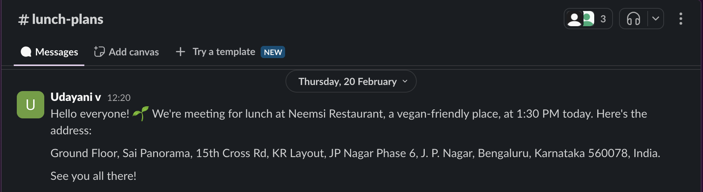

# Lunch Planner & Announcement using Spring MCP(Model Context Protocol)


The Lunch Planner & Announcement project is a small demo application showcasing the use of Model Context Protocol (MCP) to integrate AI-driven workflows. The project uses publicly available MCP servers for [Google Maps](https://github.com/modelcontextprotocol/servers/tree/main/src/google-maps) and [Slack](https://github.com/modelcontextprotocol/servers/tree/main/src/slack), enabling seamless interaction.

In this application, users can:

1. Find a nearby lunch spot that meets specific criteria (e.g., vegetarian options, distance limits) using the Google Maps MCP server

2. Announce the lunch plan (time and location) in a Slack channel using the Slack MCP server

By leveraging these MCP servers, the application demonstrates how an AI assistant can seamlessly handle location-based queries and team communication—all through natural language interactions.

## Prerequisites

- Java 17 or higher
- Maven 3.6+
- npx package manager
- OpenAI API key
- Google Maps API Key
- Slack Bot Token
- Slack Team Id

## Setup

1. Install npx (Node Package eXecute):
   First, make sure to install [npm](https://docs.npmjs.com/downloading-and-installing-node-js-and-npm)
   and then run:
   ```bash
   npm install -g npx
   ```

2. Clone the repository:
   ```bash
   git clone https://github.com/vudayani/spring-mcp-examples.git
   cd lunch-planner
   ```

3. Set up your API keys:
   ```bash
   export OPENAI_API_KEY='your-openai-api-key'
   export GOOGLE_MAPS_API_KEY='your-google-maps-api-key'
   export SLACK_BOT_TOKEN='your-slack-api-key'
   export SLACK_TEAM_ID='your_slack_team_id'
   ```
   - Fetch the Google Maps API key by following the instructions [here](https://developers.google.com/maps/documentation/javascript/get-api-key#create-api-keys)
   - Setup and fetch slack api token by following the instructions [here](https://github.com/modelcontextprotocol/servers/blob/main/src/slack/README.md#setup)
   

5. Build the application:
   ```bash
   ./mvnw clean install
   ```

## Running the Application

Run the application using Maven:
```bash
./mvnw spring-boot:run
```

Once running, the application will:

1. Parse user prompt

2. Query Google Maps to find suitable lunch spots

3. Post the finalized plan to a Slack channel

### Example:

Below is the User prompt:

```bash
User: "Find a vegan restaurant within 2 miles in jp nagar. Then let everyone in #lunch-plans on Slack know we’re meeting there at 1:30 PM."
```

Below is the slack notification:



## How It Works

Spring AI MCP simplifies AI-driven workflows by automating MCP client setup using Spring Boot’s auto-configuration. With `spring-ai-mcp-client-spring-boot-starter`, developers no longer need to manually define MCP clients, Spring AI takes care of everything, enabling seamless tool invocation.

Let us take a look at our configuration for Google Maps and Slack MCP servers. Instead of manually defining MCP clients in Java, we simply configure them in an external file (`mcp-servers-config.json`) as below:

```yaml
{
  "mcpServers": {
    "google-maps": {
      "command": "npx",
      "args": [
        "-y",
        "@modelcontextprotocol/server-google-maps"
      ],
      "env": {
      }
    },
	"slack": {
	  "command": "npx",
	  "args": [
	    "-y",
	    "@modelcontextprotocol/server-slack"
	 ],
	 "env": {
	 }
	}
  }
}
```

To make Spring AI load this configuration, add the following to `application.yml`

```yaml
spring:
  ai:
    mcp:
      client:
        stdio:
          servers-configuration: classpath:mcp-servers-config.json
```


**Environment Variables:** The required environment variables are passed to authenticate the connection. Make sure to export the required environment variables, for example:
```bash
   export GOOGLE_MAPS_API_KEY='your-google-maps-api-key'
   export SLACK_BOT_TOKEN='your-slack-api-key'
   export SLACK_TEAM_ID='your_slack_team_id'
```

#### When the application is started:
- MCP Clients are Auto-Created: Spring Boot configures MCP clients for Google Maps and Slack based on the configuration file
- MCP STDIO Communication: The application uses the MCP STDIO client to interact with the MCP servers
- Tool Auto-Discovery & Registration: Tools exposed by MCP servers are automatically registered as function callbacks, allowing the AI model to invoke them seamlessly
- ChatClient Initialization: The ChatClient is initialized with access to registered MCP tools, enabling AI-driven decision-making and execution

This is the Application code with the ChatClient orchestrating interactions between the AI and MCP servers:
```java
@Bean
	CommandLineRunner predefinedQuestions(ChatClient.Builder chatClientBuilder,
			ToolCallbackProvider tools, ConfigurableApplicationContext context) {

		return args -> {
			var chatClient = chatClientBuilder
					.defaultTools(tools)
					.build();
			
			var scanner = new Scanner(System.in);
			System.out.println("\nWelcome to the Lunch Planner Assistant! I’m here to help you plan your lunch outing and notify your team. Provide a location, any food preferences, and the Slack channel to post to. Type 'exit' to end the session at any time.");

			try {
				while (true) {
					System.out.print("\nUser: ");
					String input = scanner.nextLine();

					if (input.equalsIgnoreCase("exit")) {
						System.out.println("Ending the chat session.");
						break;
					}

					System.out.print("Assistent: ");
					System.out.println(chatClient.prompt(input).call().content());
				}
			} finally {
				scanner.close();
				context.close();
			}

			context.close();

		};
	}
```

#### The Flow:

1. User Prompt: The user provides a natural language prompt specifying location criteria and announcement details
"Find a vegan restaurant within 2 miles in jp nagar. Then let everyone in #lunch-plans on Slack know we’re meeting there at 1:30 PM."

2.  ChatClient & LLM Determine Actions: The ChatClient interacts with the LLM (OpenAI in this case) to handle the entire flow.
LLM analyzes the request and identifies the required tools:
- Google Maps -> To fetch nearby restaurant recommendations
- Slack -> To send the lunch plan notification

3. Google Maps MCP Server: The Google Maps MCP client calls the Google Maps tool to fetch restaurant data based on the user’s criteria (e.g: vegetarian options, distance limits). The server returns a list of recommendations with details like names, ratings, and addresses

4. Slack MCP Server: After selecting a restaurant, the Slacl MCP client calls the Slack tool to post an announcement in the specified channel. A friendly message is sent, detailing the time and location of the lunch plan

With Spring AI MCP, AI-driven workflows are now fully automated, eliminating manual API calls and hardcoded integrations. This approach makes AI-based assistants highly scalable and adaptable, whether you're planning team lunches, automating tasks, or integrating AI into business workflows.


